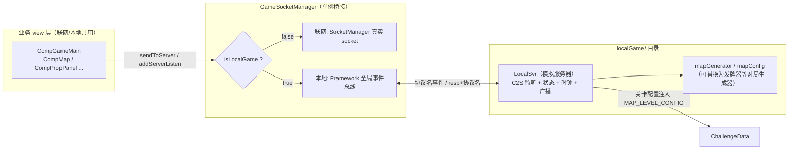

# 单机（本地）模式技术框架方案

> 本文档由连连看工程（`lianliankan`）的单机/本地模式实现提炼而来，**排除业务规则**（不展开连连看的消除/地图规则细节），只沉淀可复用的技术框架，供算 24 点（`24point` / game 10003）等新游戏工程实现单机模块时参考。
>
> 参照实现：
> - 客户端工程 `/root/.openclaw/workspace/main/lianliankan/`
> - 服务端工程 `/root/.openclaw/workspace/freeGame/`

---

## 1. 目标与适用范围

### 1.1 本地模式要解决的问题

1. **无服务器可玩**：玩家在不连游戏服（甚至断网）的情况下，也能进入完整对局（单人游戏、章节闯关）。
2. **协议级模拟**：本地进程内模拟一台"游戏服务器"，与客户端之间仍走**协议消息**（与联网模式同一套 sproto 协议），而不是让 view 层直接改数据。
3. **与联网模式共用 view 层**：UI 层（房间、对局、结算、道具面板）完全不感知联网/本地差异——它们只做两件事：`addServerListen` 收广播、`sendToServer` 发请求。本地模式下这两条通道被透明替换为进程内事件总线。
4. **可注入服务端数据**：闯关模式的关卡配置来自服务端下发（HTTP 拉取），以"外部输入"形式注入本地服务器，保证关卡内容仍由运营侧控制。

### 1.2 适用/不适用

| 适用 | 不适用 |
| --- | --- |
| 单人休闲玩法（单机一局） | 需要多玩家实时交互的对局 |
| 章节/关卡闯关（单人挑战） | 需要服务器权威仲裁的竞技玩法 |
| 玩法原型验证、断网兜底 | 反作弊/计费敏感逻辑 |
| 服务端逻辑的客户端"镜像实现" | 需要排行榜/战绩持久化的场景（另行对接大厅服） |

> 注意：**闯关扣体力、道具扣库存等"数值账目"不走本地服务器**，而是走大厅服连接（连连看里由 `LocalGameUseProps.req` 在 `LobbySocketManager` 通道发送 `SprotoLocalGameUseProps` 请求），本地只模拟对局本身的协议流。

---

## 2. 整体架构

### 2.1 角色划分

- **`LocalSvr`**（`assets/scripts/localGame/LocalSvr.ts`）：**模拟服务器**。持有"服务器端状态"（地图、分数、时钟、回合），注册 C2S 协议监听、按协议回 resp / 主动广播 S2C 协议。
- **`GameSocketManager`**（`assets/scripts/frameworks/GameSocketManager.ts`）：**事件总线桥接器**。单例，联网时继承 `SocketManager` 走真实 socket；`start(true)` 进入本地模式后，把 `addServerListen / sendToServer / removeServerListen` 全部路由到 `Framework.ts` 提供的**全局事件总线**（`AddEventListener / DispatchEvent / RemoveEventListener`）。
- **业务 view 层**（如 `CompGameMain`、`CompMap`、`CompPropPanel`）：**只与 `GameSocketManager` 交互**，不直接触碰 `LocalSvr` 内部状态（少数标志读取除外，见 §5.3）。
- **`ConnectGameSvr.connectLocalGame`**：**模式分发入口**。负责装配：设置 `LocalSvr` 模式 → `LocalSvr.start()` → `GameSocketManager.start(true)`。
- **`Framework.ts` 全局事件总线**：事件名与监听函数一一对应；`DispatchEvent` 时以注册时传入的 `target` 作为 `this` 调用（`func.call(target, ...args)`）。

### 2.2 架构图（ASCII）

```
┌─────────────────────────── 本地单机/闯关（无真实 socket） ───────────────────────────┐
│                                                                                      │
│  ┌──────────────┐   connectLocalGame  ┌───────────────────────────────────────────┐  │
│  │ 大厅/章节入口  │ ───────────────────► │ ConnectGameSvr                          │  │
│  │ (CompLobbyMain│                      │   setMode(STANDALONE|CHALLENGE)          │  │
│  │ / CompChapter)│                      │   setChallengeConfig(config)            │  │
│  └──────────────┘                      │   LocalSvr.start()                        │  │
│                                        │   GameSocketManager.start(true)           │  │
│                                        └──────────────┬────────────────────────────┘  │
│                                                       │ 同进程                        │
│                    Framework 全局事件总线（事件名 → 回调表）                            │
│   ┌───────────────────────────────┬───────────────────┴───────────────────┐          │
│   │                               │                                       │          │
│   ▼ 广播监听（S2C）                │ 请求分发（C2S）                        │          │
│ ┌────────────────┐  addServerListen │  ┌────────────────────────────────┐  │          │
│ │  业务 view 层    │ ◄────────────── │  │ LocalSvr（模拟服务器）            │  │          │
│ │ CompGameMain    │                 │  │  • 注册 C2S 监听（协议名事件）      │  │          │
│ │ CompMap / 结算   │  sendToServer   │  │  • 维护服务器端状态/规则判定        │  │          │
│ │ CompPropPanel…  │ ───────────────► │  • DispatchEvent("resp"+协议名)    │  │          │
│ └────────────────┘                  │  • DispatchEvent(协议名) 模拟推送    │  │          │
│         ▲                           │  • setInterval 时钟 / 超时结束        │  │          │
│         │  resp+协议名 一次性回调     │  • 地图/发牌/结算数据生成             │  │          │
│         └──────────────────────────►│  （镜像服务端 room/logic 逻辑）        │  │          │
│                                     └────────────────────────────────┘  │          │
│   GameSocketManager = 本地模式下的协议路由闸门（联网/本地二选一）              │          │
└──────────────────────────────────────────────────────────────────────────────────────┘

  对照：联网模式时上述本地总线不启用——GameSocketManager 走 SocketManager 真实连接，
        协议收发路径与本地模式完全对称（同一套 addServerListen/sendToServer 调用）。
```

### 2.3 架构图（Mermaid 时序视图见 §4）



---

## 3. 核心机制

### 3.1 `GameSocketManager.start(true)` 切换本地模式

`GameSocketManager extends SocketManager`。联网路径（真实 socket）的逻辑在父类 `SocketManager` 中，本地模式只覆盖了 4 个方法，用一个布尔标志分流：

```ts
private _isLocalGame: boolean = false;

// url 为 boolean 时即本地模式（联网时传入字符串地址）
start(url: string | boolean, header?, callBack?): void {
    if (typeof url === "boolean") {
        this._isLocalGame = true;          // start(true)
    } else {
        this._isLocalGame = false;
        super.start(url, header, callBack); // 真实 socket
    }
}
```

三个协议方法在本地模式下的路由（其余行为原样继承）：

| 方法 | 联网分支 | 本地分支（`_isLocalGame === true`） |
| --- | --- | --- |
| `addServerListen(proto, callBack)` | `super.addServerListen`（socket 侧广播注册） | `AddEventListener(proto.Name, callBack, this)`，并把回调存进 `_eventListeners[proto.Name]` 供移除 |
| `removeServerListen(proto)` | `super.removeServerListen` | `RemoveEventListener(proto.Name, _eventListeners[proto.Name])` 后删除该键 |
| `sendToServer(proto, data, callBack?)` | `super.sendToServer`（发到 socket） | **先**为 `"resp" + proto.Name` 注册一次性回调包装，**再** `DispatchEvent(proto.Name, data)` 原路"发出"请求 |

`sendToServer` 本地分支的包装函数是关键细节：

```ts
const func = (data) => {
    callBack && callBack(data);                    // 回调业务方
    RemoveEventListener("resp" + xy.Name, func);   // 一次性：收到 resp 后立即自移除
};
AddEventListener("resp" + xy.Name, func, this);    // 等待 LocalSvr 回 resp
DispatchEvent(xy.Name, data);                      // 触发 LocalSvr 的 C2S 监听
```

由此得到三条规则：

1. **C2S 请求** = `DispatchEvent(协议名)`；`LocalSvr` 以 `AddEventListener(协议名, handler)` 接收。
2. **请求响应** = `DispatchEvent("resp" + 协议名)`；`sendToServer` 传入的 `callBack` 收到它，且**仅触发一次**（自移除），多次并发请求互不覆盖。
3. **服务器推送（S2C 广播）** = `DispatchEvent(协议名)`；view 通过 `addServerListen` 注册的处理器收到它——本地模式下 `addServerListen` 就是往同一张总线上注册。

> 与联网模式的对称性：联网时这些事件来自远端，本地时来自 `LocalSvr` 的同进程调用；view 代码零改动。

### 3.2 `LocalSvr` 的职责

`LocalSvr`（连连看实现 908 行）是"本地模式的服务端"，职责可归纳为五块：

1. **注册 C2S 协议监听**：`start()` 先 `this.destroy()` 清旧，再逐个 `AddEventListener(SprotoXxx.Name, this.onXxx, this)`（见 §3.4）。
2. **模拟服务器推送**：`dispatchEvent(name, data)` = `DispatchEvent(name, data)`，按联网模式服务端推送的**同字段结构**组包下发（房信息、开局、地图、广播、结束……）。
3. **回请求响应**：`dispatchEventResp(name, data)` = `DispatchEvent("resp" + name, data)`，与 `GameSocketManager.sendToServer` 的 resp 监听约定配对；响应体沿用 `{ code, msg, ... }` 约定（`code === 1` 成功，业务字段紧随其后）。
4. **时钟/超时管理**：`_startClock`（`setInterval` 1000ms 递减，初值 `_totalTime` 来自对局配置）→ `_onTimeout` → `onGameFinished`；`_stopClock` 在结束/销毁时清理。`_totalTime <= 0` 表示不需要倒计时，不下发时钟协议也不启动定时器。
5. **模式与关卡配置注入**：`setMode(LOCAL_SVR_MODE.xxx)` + `setChallengeConfig(MAP_LEVEL_CONFIG)`；`startStepGame` / 结算等流程按 `_mode` 分支（单机取随机生成配置，闯关取注入的关卡配置）。
6. **持有并维护"服务器端状态"**：本局地图/分数/进度/回合号只存在 `LocalSvr` 内，view 的所有变更都必须经过协议（本地**不做合法性校验、直接放行**，见 §7）。

### 3.3 协议事件命名约定（一条贯穿全文的规则）

```
C2S 请求事件      = 协议名（如 "clickTiles" / "clientReady" / "submitAnswer"）
C2S 响应事件      = "resp" + 协议名（如 "respclickTiles"）
S2C 服务器推送    = 协议名（如 "mapData" / "gameEnd" / "dealCards"）
```

协议名取自自动生成的协议模块的静态常量：`SprotoClientReady.Name === "clientReady"`（连连看与 24point 的 `assets/types/protocol/game<id>/c2s.ts | s2c.ts` 同风格）。**代码中一律引用 `SprotoXxx.Name`，不要手写字符串**。

### 3.4 生命周期

```
connectLocalGame（入口装配）
  ├─ setMode / setChallengeConfig      ① 先决定 LocalSvr 运行模式
  ├─ LocalSvr.start()
  │     └─ destroy()                   ② 先清旧监听（多次进入不累积）
  │     └─ AddEventListener × N        ③ 注册本局所需 C2S 协议监听
  ├─ GameSocketManager.start(true)     ④ 再打开"本地 socket"（置 _isLocalGame）
  └─ callBack(true) → 切场景

CompGameMain（view 侧）
  ├─ init()       读 GameSocketManager.isLocalGame() / LocalSvr.isChallengeMode() → 写 GameData 标志
  ├─ initListeners()  addServerListen × N 注册 S2C 广播监听
  ├─ onConstruct   scheduleOnce(0) → sendClientReady()（sendToServer(SprotoClientReady, {})）触发开局
  └─ onDestroy()   removeListeners() +（本地/闯关时）LocalSvr.destroy() + GameSocketManager.close()

退房/回大厅
  └─ changeToLobbyScene() / onBtnBack()
       ├─ （本地/闯关时）LocalSvr.destroy()   ← 移除 C2S 监听并停时钟
       └─ GameSocketManager.isOpen() && GameSocketManager.close()
```

要点：

- **先 `LocalSvr.start()` 后 `GameSocketManager.start(true)`**：监听先就位，view 切场景后发 `clientReady` 才能被接住。
- `LocalSvr.start()` 内部第一行就是 `this.destroy()`——**多次 start 天然幂等**，这是防监听累积的第一道闸。
- **销毁责任在 view 的 `onDestroy`**：view 销毁时必须 `LocalSvr.destroy()`，否则下次进入会带着旧监听/旧定时器（`LocalSvr` 是进程级单例，不随场景卸载）。
- 本地模式没有真实 socket，`onOpen/onClose/agentReady` 等 socket 生命周期**不参与**本地流程。

### 3.5 与服务端一致性原则

**本地 `LocalSvr` 是服务端 room/logic 逻辑的客户端"镜像"，这是整个方案的正确性根基。** 每个本地处理的协议，都应能找到服务端对应处理函数，字段与判定语义保持一致：

| 环节 | 服务端（`freeGame/src/services/games/10002/`） | 客户端本地镜像（连连看） |
| --- | --- | --- |
| C2S 请求处理 | `room.lua` 的 `REQUEST:clientReady / gameReady / ownerStartGame / leaveRoom / clickTiles / useItem` | `LocalSvr.onClientReady / onGameReady / onOwnerStartGame / onLeaveRoom / onClickTiles / onUseItem`（同名一对一） |
| 单局流程/判定/结算 | `logic.lua`（阶段 START→PLAYING→END、地图与消除判定、`logic.shiftDir/shiftEdge`、结算） | `LocalSvr.startStepGame / onClickTiles / onGameFinished` |
| 地图生成 | `mapGenerator.lua`（`generate(iconTypes, designMap)` + `_hasSolution`，洗牌保证可解） | `localGame/mapGenerator.ts`（`generateFromDesign` / `generateRandomMap`，同源算法：偶数图标、Fisher-Yates、不可解自动重排） |
| 消除路径判定 | `pathFinder.lua` / `map.lua` | `LocalSvr._canConnect0Turn/_1Turn/_2Turn` + `_buildConnectionLines`（**独立实现、不依赖 view 侧 PathFinder**，但与 view 必须同语义） |
| 地图配置 | `mapConfig.lua` | `localGame/mapConfig.ts`（设计模板 + 参数） |

联动后果：

- **地图数据字段**：服务端 push `mapData`（地图二维数组、总块数、行列）→ 本地 `_dispatchMapData()` 以 `JSON.stringify` 串下发同结构消息，view 解析代码两份共用。
- **算法漂移风险**：本地镜像一旦与服务端/客户端逻辑区不一致，会出现"本地能消/服务端不能消"之类的行为分裂；改动任何一侧需同步另一侧（见 §7）。

---

## 4. 典型对局时序（文字时序图）

以连连看单机一局为例（流程骨架与游戏无关，括号标注每个协议走哪条总线规则）：

```
[大厅] CompLobbyMain.onBtnLocalgame()
  └► ConnectGameSvr.connectLocalGame({ gameid: 10002 })
       1. LocalSvr.setMode(LOCAL_SVR_MODE.STANDALONE)
       2. LocalSvr.start()                       // destroy() 清旧 → 注册 clientReady/clickTiles/useItem/
                                                 //   gameReady/leaveRoom/ownerStartGame 六个 C2S 监听
       3. GameSocketManager.start(true)          // 切本地模式
       4. callBack(true)

[切场景] ChangeScene("GameScene")
  └► CompGameMain.onConstruct()
       5. init()：GameSocketManager.isLocalGame() && !LocalSvr.isChallengeMode()
            → GameData.isLocalGame = true
       6. initListeners()：addServerListen(SprotoRoomInfo / GameStart / StepId / MapData /
            TilesRemoved / ProgressUpdate / ...)      // 全部落到全局总线
       7. scheduleOnce(0)：sendClientReady()
            → GameSocketManager.sendToServer(SprotoClientReady, {})
               ├─ AddEventListener("respclientReady", 一次性回调)
               └─ DispatchEvent("clientReady")          // C2S：协议名事件

[LocalSvr] onClientReady()
       8. startStepGame()：
            DispatchEvent(roomInfo)                     // S2C 推送：协议名事件
            DispatchEvent(gameStart {})
            DispatchEvent(stepId { step: 2 })
            DispatchEvent(playerInfos + playerEnter)    // 本机 seat=1
            randomMap()：
              └► DispatchEvent(mapData)                 // 地图生成+下发
              └► _startClock()：totalTime>0 时 DispatchEvent(gameClock)
            DispatchEvent(logicInfo)                    // 附加规则参数（ext JSON）

[玩家操作：消除]
   CompMap → GameSocketManager.sendToServer(SprotoClickTiles, { row1,col1,row2,col2 }, respCB)
       9. DispatchEvent("clickTiles")
[LocalSvr] onClickTiles()
      10. 更新服务器端地图状态 → 算分/连击/进度
      11. dispatchEventResp("clickTiles", { code:1, ... })     // resp 事件 → sendToServer 的 respCB 收到
      12. DispatchEvent(tilesRemoved { lines, ... })           // 广播：view 播放消除表现
      13. DispatchEvent(progressUpdate / comboSuccess?)        // 广播进度/连击
      14. （无解时）自动打乱 → DispatchEvent(mapShuffled) + DispatchEvent(mapData)
      15. 全部消除 → onGameFinished()

[玩家操作：道具]
   CompPropPanel.sendUseItem → sendToServer(SprotoUseItem, { itemId }, respCB)
      └► LocalSvr.onUseItem → handleUpset/handleAutoRemove
            ├─ dispatchEventResp("useItem", { code, richNum })
            ├─ DispatchEvent(itemEffect)      // 广播道具表现
            └─ DispatchEvent(mapShuffled / 复用消除广播...)

[结束]
   LocalSvr.onGameFinished()
      16. _stopClock()；totalTime>0 → DispatchEvent(gameClock { time: 0 })
      17. 按模式判定 endType/rank（闯关：TIMING 超时 → FAIL；SCORING 未达 targetScore → FAIL；达标按 starTime/starScore 折算星星 0-3）
      18. DispatchEvent(stepId { step: 3 })                  // END 阶段
      19. DispatchEvent(playerFinished { seat, usedTime, rank })
      20. DispatchEvent(gameEnd { endType, rankings[], scores[] })   // view 弹结算

[退出]
   CompGameMain.changeToLobbyScene() / onDestroy()
      21. LocalSvr.destroy()                  // RemoveEventListener × N + _stopClock()
      22. GameSocketManager.close()（isOpen 为 false，本地无操作）
```

要点回顾：**进入本地对局 = 一次 `clientReady` 触发开局**；**玩家操作一律走 C2S**（连"自己消除自己"都不例外）；**结果一律由 `LocalSvr` 以 S2C 广播回投**——与联网时"服务端裁决、全员广播"完全同构。

---

## 5. 目录与命名约定

### 5.1 目录

```
assets/scripts/localGame/          # 本地模式专属代码（别名 @localGame/*）
├── LocalSvr.ts                    # 模拟服务器（单例）—— 唯一"服务端大脑"
├── mapGenerator.ts / mapConfig.ts # 对局内容生成器（连连看：地图；24点：可换为发牌器）
assets/scripts/frameworks/
├── GameSocketManager.ts           # 联网/本地 双通道闸门（本地桥接逻辑就在此文件）
├── Framework.ts                   # 全局事件总线 AddEventListener / DispatchEvent / RemoveEventListener
└── SocketManager.ts               # 真实 socket 基类（联网分支）
assets/scripts/modules/
└── ConnectGameSvr.ts              # connectLocalGame 入口（本地模式装配）
assets/scripts/games/game<id>/data/GameData.ts   # isLocalGame / isChallengeMode 标志（view 层消费）
assets/types/protocol/game<id>/    # c2s.ts / s2c.ts（sproto 自动生成，勿手改）
```

### 5.2 命名约定

| 符号 | 约定 |
| --- | --- |
| `LOCAL_SVR_MODE` | 运行模式枚举：`STANDALONE = 0`（单机，随机生成对局）、`CHALLENGE = 1`（闯关，注入关卡配置） |
| `LocalSvr.instance` | 进程级单例（`static get instance()`），`new LocalSvr()` 私有于类内部 |
| `LocalSvr` 成员 | C2S 处理函数命名 `on<协议名>`（如 `onClientReady`）；私有工具 `_` 前缀（`_canConnect`、`_startClock` 等） |
| `isChallengeMode()` / `setMode()` / `setChallengeConfig()` | 模式查询与注入的对外方法，**只有这三个方法允许 view/入口读取 LocalSvr 状态** |
| `start()` / `destroy()` | 对称生命周期：start 注册全部 C2S 监听（内部先 destroy），destroy 移除全部监听并停时钟 |
| `dispatchEventResp(name)` | 专发 `"resp"+name` 事件（请求响应通道），内部私有于 LocalSvr |
| `dispatchEvent(name)` | 专发 S2C 广播（协议名事件） |
| GameData 标志 | `isLocalGame`（单机）/ `isChallengeMode`（闯关）——view 层分支只读这两个标志，**不要直接依赖 socket 状态** |

### 5.3 标志位用法（`GameData.isLocalGame / isChallengeMode`）

在 `CompGameMain.init()` 里一次性确定，此后整局只读：

```ts
// GameData 字段是 view 层"我现在是不是本地/闯关"的唯一事实源
if (GameSocketManager.instance.isLocalGame()) {
    if (LocalSvr.instance.isChallengeMode()) {
        GameData.instance.isChallengeMode = true;   // 闯关
    } else {
        GameData.instance.isLocalGame = true;       // 单机
    }
}
```

典型分支点（连连看 view 侧，仅示意类别）：
- **UI 差异**：房间类型角标（`ROOM_TYPE.CHALLENGE / LOCAL`）、时钟组件显隐（计时/计分规则）；
- **交互差异**：断线弹窗对本地模式直接 return（本地不可能断线）、退出闯关加二级确认、部分按钮（准备/房主开始）在本地分支跳过；
- **生命周期**：`onDestroy` / `changeToLobbyScene` 里 `isLocalGame || isChallengeMode` 时才 `LocalSvr.instance.destroy()`。

> 反例警示：view 里**不应** `instanceof` 或直接 new 另一份 LocalSvr，也不应绕过协议直接改 `LocalSvr` 内部状态字段（它们命名带 `_`，约定即私有）。

---

## 6. 新游戏（game 10003 / 算24点）接入步骤清单

24point 工程已具备与本方案一致的骨架（经验证与连连看**逐字节一致**）：`frameworks/GameSocketManager.ts`（含本地桥接）、`frameworks/Framework.ts`、`modules/ConnectGameSvr.ts.connectLocalGame`、`datacenter/ChallengeData.ts`、大厅/章节入口（`CompLobbyMain.onBtnLocalgame`、`CompChapter.doStartChallenge` 已调用 `connectLocalGame({ gameid: 10003, challengeConfig })`）、`GameData.isLocalGame/isChallengeMode`。**唯缺 `localGame/LocalSvr.ts` 的业务实现**（当前为 176 行占位：保留 `LOCAL_SVR_MODE`、`start/destroy`、`dispatchEventResp/dispatchEvent`、时钟管理、`startStepGame/onGameFinished` 空壳，协议注册处为 TODO）。

按下列步骤补齐：

1. **盘点并复用协议**（已生成，勿新增）：
   - `assets/types/protocol/game10003/c2s.ts`：`clientReady / gameReady / leaveRoom / ownerStartGame / submitAnswer / forwardMessage / vote*` 等；
   - `assets/types/protocol/game10003/s2c.ts`：`roomInfo / roomEnd / playerInfos / playerEnter / gameStart / stepId / dealCards / answerResult / gameEnd / gameClock / totalResult / gameRelink ...`（注意与连连看的差异：10003 没有 `playerFinished/tilesRemoved/progressUpdate` 等局内广播，本局以 `answerResult → gameEnd` 直接收尾，对应命名空间 `SprotoAnswerResult`）；
   - 风格确认：`SprotoClientReady.Name === "clientReady"`，与连连看一致。

2. **填 `LocalSvr.ts` 的 start()/destroy()**：注册/移除本局需要的 C2S 监听，最少两个即可跑通单局——
   - `AddEventListener(SprotoClientReady.Name, this.onClientReady, this)` → `startStepGame()`（发牌开局）；
   - `AddEventListener(SprotoSubmitAnswer.Name, this.onSubmitAnswer, this)` → 判定并结算；
   - 其余（`gameReady/ownerStartGame/leaveRoom`）可按需补齐，handler 里 `dispatchEventResp(...)` 回 `{ code: 1, msg: "" }` 即可。

3. **镜像服务端 10003 逻辑**（对照 `/root/.openclaw/workspace/freeGame/src/services/games/10003/`）：
   - `room.lua` 的 `REQUEST:clientReady / REQUEST:submitAnswer` → 一一映射到 LocalSvr handler；
   - `logic.lua` 单局流程（START→发牌 `dealCards`→PLAYING→`submitAnswer` 校验→第一个答对者本局结束→`gameEnd` 结算排名/分数）原样复刻为 `startStepGame / onSubmitAnswer / onGameFinished`；
   - **发牌可解性与表达式判定算法**：服务端 `solver.lua`（保证发牌有解）+ `expression.lua`（分数精确运算，支持 `8/(3-8/3)` 型中间结果）需在客户端有同语义实现/移植——客户端已有 `games/game10003/logic/Expression.ts` 可对照接线；
   - 广播组包字段（`dealCards` 的牌面结构、`answerResult` 的判定/奖励字段）严格按 s2c.ts 接口定义，与服务端 push 同构。

4. **接时钟与结束**：LocalSvr 已内置 `_startClock/_stopClock/_onTimeout`（占位版 `startStepGame` 已调用），只需在开局时按对局配置设置 `_totalTime`（闯关取 `MAP_LEVEL_CONFIG.totalTime`，超时按关卡规则判 FAIL）；结算时复用 `stepId → gameEnd` 推送顺序。

5. **对齐 view 分支点**：以 `GameData.isLocalGame / isChallengeMode` 为分支依据，在 `CompGameMain` 处理房间类型/时钟/结算/退出确认等差异（参照 §5.3 类别），并保证 `onDestroy` 里本地/闯关时 `LocalSvr.instance.destroy()`。

6. **入口装配验证**：`connectLocalGame` 已存在且与连连看一致（`setMode` → `LocalSvr.start()` → `GameSocketManager.start(true)`），LocalSvr 实现后单机/闯关即可跑通；单机用 `{ gameid: MAIN_GAME_ID }`（=10003），闯关用 `{ gameid: 10003, challengeConfig: config }`。

7. **一致性验收清单**（防"本地与服务端行为分裂"）：
   - [ ] 发牌：任意牌面服务端求解器判定有解；
   - [ ] 判定：表达式 =24（分数精确）且四数字恰好各用一次，与 `logic.lua` 规则一致；
   - [ ] 结算：`gameEnd` 字段、排名/分数/星星与 `scoring.lua` / 关卡 `starTime/starScore` 一致；
   - [ ] 时钟：`gameClock` 初值/归零、超时 FAIL 与服务端一致；
   - [ ] resp 约定：所有 `sendToServer(xxx, cb)` 的协议都有 `resp` 应答且 `code` 语义一致。

---

## 7. 注意事项 / 陷阱

1. **多次 start 防监听累积**：`LocalSvr.start()` 第一行必须 `this.destroy()`（连连看注释原文："先清理旧监听，确保多次调用不累积"）。同理 view `initListeners()` 与 `removeListeners()` 必须成对，`addServerListen` 存储回调（`_eventListeners[proto.Name]`）供 `removeServerListen` 精确移除——`Framework.AddEventListener` 只对**同一函数引用**去重，`.bind()` 产生的新函数每次都是新引用，必须存原引用再移除。

2. **resp 一次性回调**：`sendToServer` 的本地包装在收到 resp 后立即 `RemoveEventListener`——**别指望同一监听被触发两次**；也不要跨请求复用回调。多个并发请求各自注册、各自消费，天然隔离（连连看 `LocalGameUseProps.req` 注释："resp 作为临时闭包避免多次调用时回调覆盖"，同一思路）。

3. **定时器清理**：时钟 `setInterval` 是本地模式唯一"常驻副作用"。三处必须 `_stopClock()`：正常结束（`onGameFinished`）、超时（`_onTimeout` 内部先停再结束）、销毁（`destroy`）。漏一处 → 场景切走仍每秒 tick、残留事件或重复结算。另：`_totalTime <= 0` 时**不创建**定时器也不发时钟协议。

4. **联网/本地双通道分支点收敛**：通道分流只允许发生在 `GameSocketManager`（三个方法）与 `ConnectGameSvr.connectLocalGame`（装配）；业务代码只能消费 `GameData.isLocalGame/isChallengeMode` 做**表现层**分支，不要到处 `GameSocketManager.isLocalGame()`（它只应在 `init()` 阶段用于推导 GameData 标志）。新增"发请求"代码一律走 `sendToServer`，禁止在本地分支直连 socket 裸发（本地根本没有 socket，`isOpen()` 恒 false）。

5. **销毁责任链**：`LocalSvr` 是进程级单例，**场景卸载不会自动销毁它**。凡 view 的 `onDestroy` 与"回大厅"路径都要判断并 `LocalSvr.destroy()`；闯关退出若带二次确认（如"退出将放弃本局进度"），确认后才可 destroy——先确认后清理，顺序不能反。

6. **本地不做合法性校验**（连连看 `onClickTiles` 注释："本地模式不做合法性校验，直接放行"）：本地服务端按"信任客户端"设计，代码路径更短，但**别把这种信任带进联网模式**；反过来，本地也必须维护自己的"服务器端状态"，防止 view 直接改数据造成状态漂移。

7. **镜像算法一致性**：
   - 本地规则判定（如 `_canConnect` 系）**故意独立实现、不依赖 view 侧 PathFinder**——两侧代码必须语义一致（同一对输入给相同结论），改动需双端同步并回归；
   - 地图/发牌生成、洗牌保证可解（`_ensureSolvable`，最多 100 次尝试）等"生成器"应与服务端 `mapGenerator.lua` 同源演进；
   - 数据序列化保持一致：本地 `mapData` 用 `JSON.stringify` 二维数组下发，view 解析与联网共用一份代码，字段（行列、块数、障碍值阈值 `>= 100` 等）不得私自改。

8. **本地模式没有的 socket 能力**：`onOpen/onClose/agentReady/断线重连` 等生命周期不触发——断线弹窗等逻辑必须对本地分支短路（连连看 `onGameSocketDisconnect` 对 `isLocalGame` 直接 return），否则会弹出"游戏已断开"假警报。

9. **seat 语义**：本地对局固定 `selfSeat = 1`，`rankings/scores/playerInfos` 等数组都是单元素——涉及座位查找（`getSelfSeat`、otherPlayer 等）的 view 代码在本地分支的表现要单独验证，别假设"存在其他玩家"。

10. **协议文件勿手改**：`assets/types/protocol/game<id>/c2s.ts | s2c.ts` 由 `assets/protocol/game<id>/*.sproto` 自动生成（头部有 "Auto-generated" 声明）；要加协议改 .sproto 再生成，`LocalSvr` 与 view 只引用 `SprotoXxx.Name / Request / Response` 类型。

---

## 附：源码索引（本文所有符号出处，自查用）

| 文件 | 作用 |
| --- | --- |
| `lianliankan/assets/scripts/localGame/LocalSvr.ts` | 核心参考：模拟服务器全量实现（908 行） |
| `lianliankan/assets/scripts/localGame/mapGenerator.ts` / `mapConfig.ts` | 对局内容生成器样例 |
| `lianliankan/assets/scripts/frameworks/GameSocketManager.ts` | 本地模式桥接（start(true) 三方法分流） |
| `lianliankan/assets/scripts/frameworks/Framework.ts` | 全局事件总线（Add/Remove/DispatchEvent） |
| `lianliankan/assets/scripts/frameworks/SocketManager.ts` | 真实 socket 基类（联网对照） |
| `lianliankan/assets/scripts/modules/ConnectGameSvr.ts` | `connectLocalGame` 入口装配 |
| `lianliankan/assets/scripts/games/game10002/view/game/comp/CompGameMain.ts` | view 生命周期/标志位/清理范例 |
| `lianliankan/assets/scripts/games/game10002/data/GameData.ts` | `isLocalGame / isChallengeMode` 标志 |
| `lianliankan/assets/scripts/modules/LocalGameUseProps.ts` | 道具账目走大厅服（不走本地）范例 |
| `lianliankan/assets/scripts/datacenter/ChallengeData.ts` | `MAP_LEVEL_CONFIG / CHALLENGE_LEVEL_TYPE / CHALLENGE_END_TYPE` |
| `lianliankan/assets/scripts/games/game10002/logic/TileMapData.ts` | `shiftMap / SHIFT_DIR`（本地与服务端共享语义的移动规则） |
| `lianliankan/assets/types/protocol/game10002/c2s.ts | s2c.ts` | 协议命名空间风格（`SprotoXxx.Name`） |
| `freeGame/src/services/games/10002/room.lua | logic.lua | mapGenerator.lua` | 服务端对照（本地镜像源） |
| `24point/assets/scripts/localGame/LocalSvr.ts` | 24point 现状：框架占位（待填业务） |
| `24point/assets/types/protocol/game10003/c2s.ts | s2c.ts` | 24point 协议命名风格 |
| `freeGame/src/services/games/10003/room.lua | logic.lua | solver.lua | expression.lua` | 24point 服务端镜像源 |
